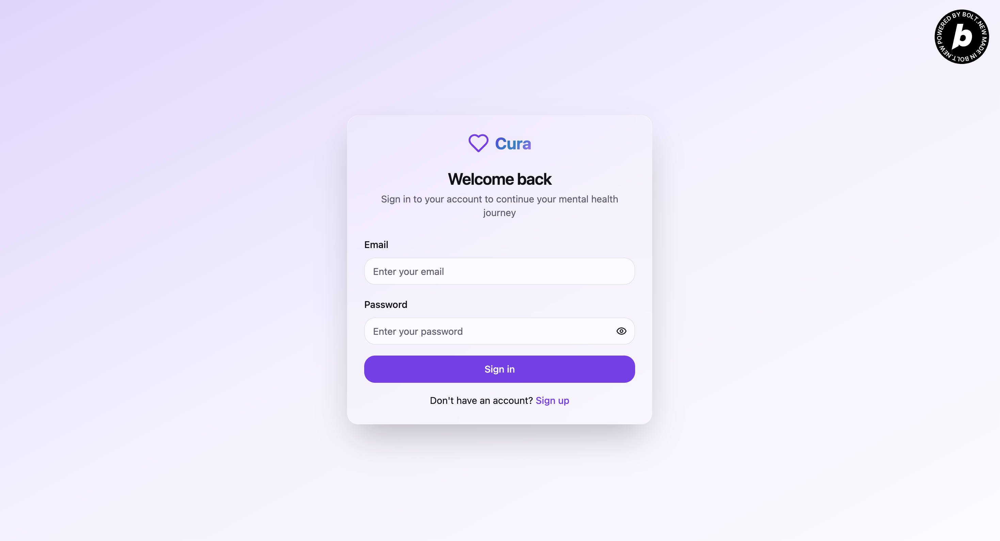
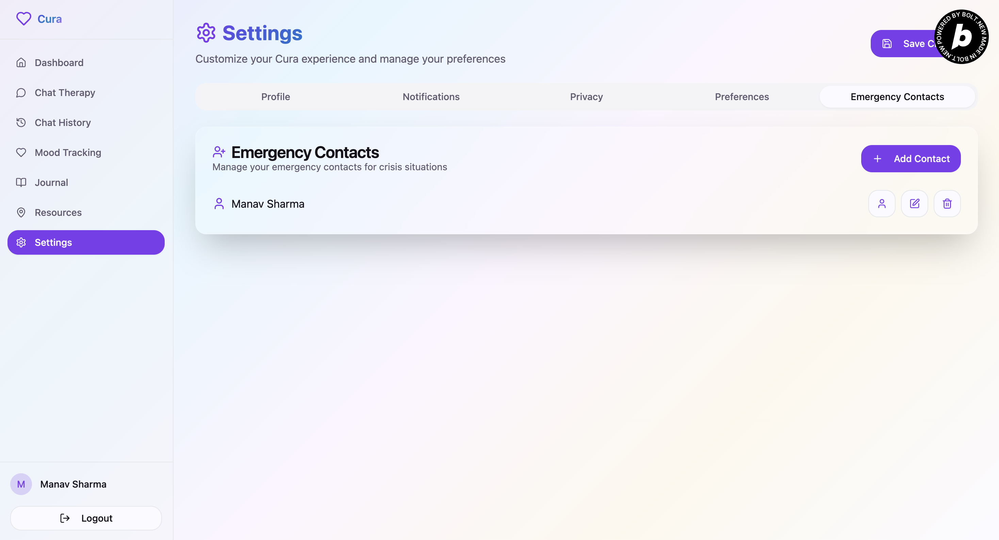

# CuraCompanion 🧠💬

> **Your AI-powered mental health companion: chat, track, journal, and get help—anytime, anywhere.**

---


---

## 🌟 Project Story & Inspiration

CuraCompanion was born to make mental health support accessible, proactive, and compassionate. Inspired by the growing mental health crisis and the barriers many face in seeking help, CuraCompanion combines AI, real-time analytics, and human-centred design to empower users on their mental health journey.

---

## 🚀 Features

- **AI Chat & Therapy**: Text, voice, and video therapy with empathetic AI
- **Mood Tracking**: Daily check-ins, analytics, and AI-generated insights
- **Journaling**: Secure, private, with voice-to-text and prompts
- **Crisis Detection**: Real-time detection in all user data, instant SMS/call alerts
- **Resource Finder**: Location-aware local and online mental health resources
- **Emergency Support**: Editable contacts, instant alerting, live notifications
- **Offline & Multilingual**: Works offline, supports multiple languages

---

## 🛠️ Tech Stack

**Languages:**
- TypeScript (frontend)
- JavaScript (backend)

**Frontend:**
- React (Vite)
- React Router
- Radix UI, Lucide React, Sonner, Recharts
- Tailwind CSS

**Backend:**
- Node.js, Express.js
- MongoDB (Mongoose)
- Node-Cache, Bcrypt, Dotenv

**APIs & Integrations:**
- OpenAI, OpenRouter (LLM)
- ElevenLabs (voice)
- Google Places API (resources)
- Twilio (SMS/call alerts)
- Geolocation API (browser)

**Cloud & Platforms:**
- MongoDB Atlas
- Vercel/Netlify (frontend hosting)
- Render/Heroku/DigitalOcean (backend hosting)

**Dev Tools:**
- Vite, ESLint, Prettier, Git, GitHub

---

## 🏗️ Architecture


---

## 🖥️ Screenshots







---

## ⚡ Getting Started

### Prerequisites
- Node.js (v16+)
- npm
- MongoDB

### 1. Clone the repo
```sh
git clone https://github.com/your-username/CuraCompanion.git
cd CuraCompanion
```

### 2. Install dependencies
```sh
npm install
```

### 3. Set up environment variables
- Copy `.env.example` to `.env` in both `client/` and `server/` and fill in your API keys (OpenAI, ElevenLabs, Twilio, Google, MongoDB, etc.)

### 4. Run the app
```sh
npm run start
```
- Frontend: http://localhost:5173
- Backend: http://localhost:3000

---

## 🤝 Contributing

Pull requests are welcome, but for major changes, please open an issue first to discuss what you would like to change.

---

## 📬 Contact

- **Author:** Manav Sharma
- **Email:** [onlyfordrivebackup3@gmail.com](mailto:onlyfordrivebackup3@gmail.com)
- **Project:** [CuraCompanion](curacompanion.netlify.app)
- **Video:** [YoutubeVideo](https://www.youtube.com/watch?v=2UjpeDV2pnM)

---

> _CuraCompanion is more than just an app—it's a step toward making mental health support accessible, proactive, and compassionate._ 
